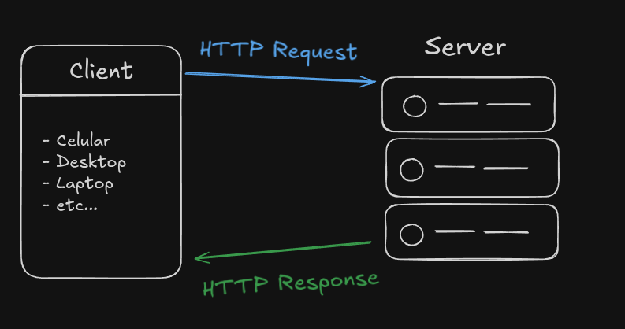
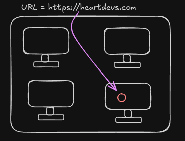
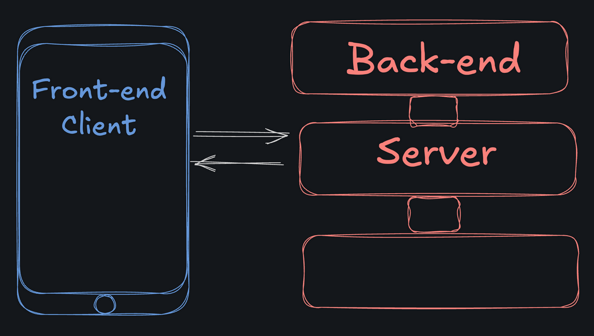

# Intro

## Índice

- [Comunicação na Web](#comunicacao-na-web)
- [HTTP Requests e Responses](#http-requests-e-responses)
- [HTTP URLs](#http-urls)
- [Web Clients](#web-clients)
- [Servidores Web](#servidores-web)
  - [Ouvindo (Listening) e Fornecendo (Serving) Dados](#ouvindo-listening-e-fornecendo-serving-dados)
  - [O Servidor é o Back-End](#o-servidor-é-o-back-end)
  - [Um Servidor é Apenas um Computador](#um-servidor-é-apenas-um-computador)

## Comunicacao na Web

O Instagram seria péssimo se você tivesse que copiar manualmente suas fotos para o celular do seu amigo sempre que quisesse compartilhá-las. Os aplicativos atualmente, precisam ser capazes de comunicar informações entre dispositivos pela internet.

O Gmail não armazena seus e-mails apenas em variáveis no seu computador, mas também em seus data centers.
Você não perde suas mensagens do Whatsapp se deixar seu celular cair no vaso; essas mensagens existem nos servidores do Whatsapp.

Mas, como funciona a comunicação na Web?

Quando dois computadores se comunicam, eles precisam usar as mesmas regras. Um falante da lingua portuguesa não conseguiria se comunicar com um falante da lingua japonesa, da mesma forma, dois computadores precisam falar a mesma língua para se comunicar.

Essa "linguagem" utilizada entre os computadores se chama protocolo. O protocolo mais popular para comunicação na Web é o HTTP, que significa Hypertext Transfer Protocol (Protocolo de Transferência de Hipertexto).

## HTTP Requests e Responses

No geral, o HTTP segue um sistema simples de requisição-resposta.

O computador "requerente", também conhecido como "client", solicita informações a outro computador. Esse outro computador é conhecido como "server", que envia uma resposta com as informações solicitadas

## HTTP URLs

Uma URL, ou Uniform Resource Locator (Localizador Uniforme de Recursos), é o endereço de outro computador, ou "servidor", na internet. Parte da URL especifica onde acessar o servidor, e parte dela informa ao servidor qual informação desejamos.

Simplificando, uma URL representa uma informação que está em algum computador. Podemos acessá-la fazendo uma requisição e lendo a resposta que o servidor nos envia.

## Web Clients

Como já discutimos, um cliente web é um dispositivo que faz requisições a um servidor web.

Um cliente pode ser qualquer tipo de dispositivo, mas geralmente é algo com o qual os usuários interagem fisicamente. Por exemplo:

- Um computador desktop
- Um celular
- Um tablet

Em um site ou aplicativo web, chamamos o dispositivo do usuário de "front-end".

Um cliente front-end faz requisições a um servidor back-end.

## Servidores Web

Embora você sempre use variáveis para armazenar e manipular dados enquanto seu programa estiver em execução, a maioria dos sites e aplicativos usa um servidor web para armazenar, classificar e fornecer esses dados, de forma que eles permaneçam disponíveis por mais tempo do que uma única sessão e possam ser acessados por vários dispositivos.

### Ouvindo (Listening) e Fornecendo (Serving) Dados

Assim como um garçom em um restaurante leva sua comida à mesa, um servidor web fornece recursos da web, como páginas da web, imagens e outros dados. O servidor fica ligado e "ouvindo" solicitações de entrada constantemente, para que, assim que receber uma nova solicitação, possa enviar uma resposta apropriada.

### O Servidor é o Back-End

Enquanto o "front-end" de um site ou aplicativo web é o dispositivo com o qual o usuário interage, o "back-end" é o servidor que mantém todos os dados armazenados em um local central.

### Um Servidor é Apenas um Computador

"Servidor" é apenas o nome que damos a um computador que assume a função de fornecer dados através de uma conexão de rede. Um bom servidor fica ligado e disponível 24 horas por dia, 7 dias por semana. Embora seu computador possa ser usado como servidor, faz mais sentido usar um computador em um data center projetado para estar em funcionamento constante.
